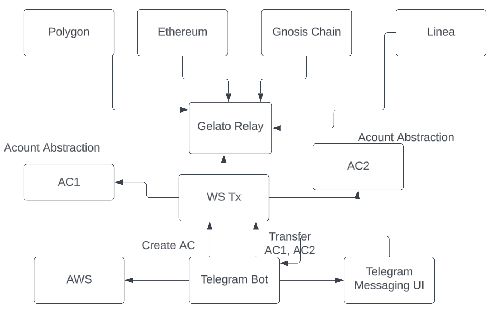

# FAST-ETH-NYC




F.A.S.T stands for Facial Address State Transfer.

It was inspired by a conversation at the hackathon, where someone remarked that it'd be cool to send money to someone's wallet address by just taking a picture of their face.

We took it on as a challenge, and decided to see if we could build it.

The core problems are quite simple:

Web3 adoption is quite low due to reasonably technical barriers to entry.
Users don't know their own address, and almost definitely don't know someone else's address.
Our hypothesis is that AI will enable super high distribution of web3 in the following ways:

People will have an easier chat interface vs. hard to understand UX
AI will enable better ways to link people to their addresses and bring greater adoption into the Web3 world

Fast Tx Service
To build the repo:

```
yarn install && yarn build
```

API
Get new Safe Wallet
```
```
Create new transfer


